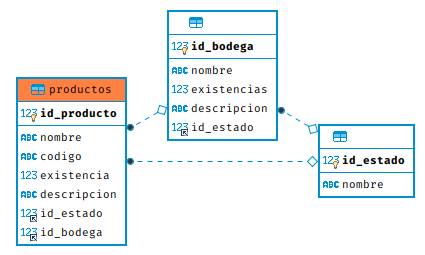
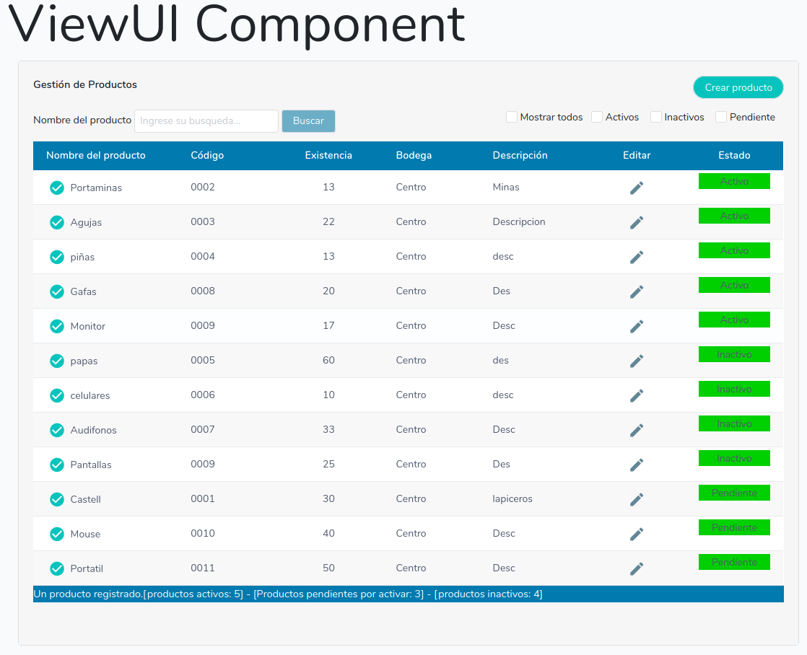
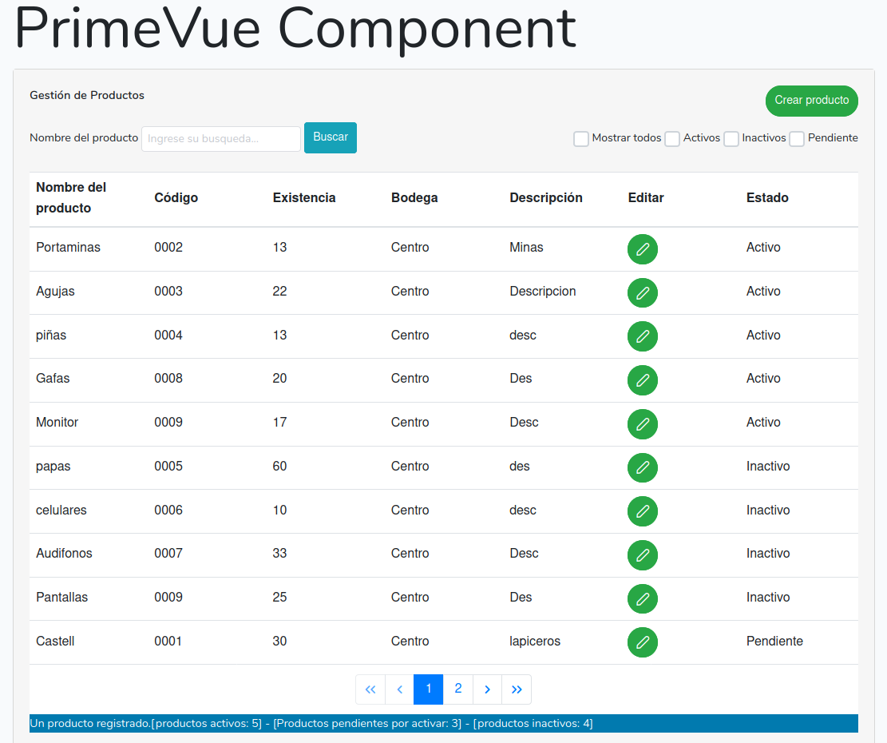
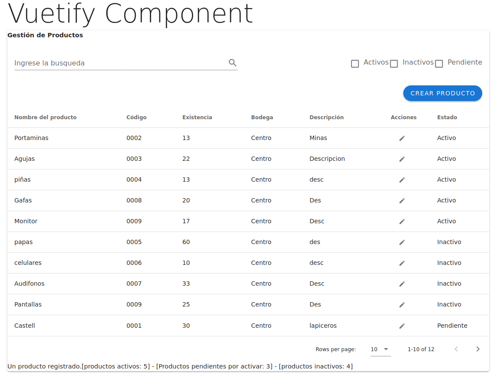
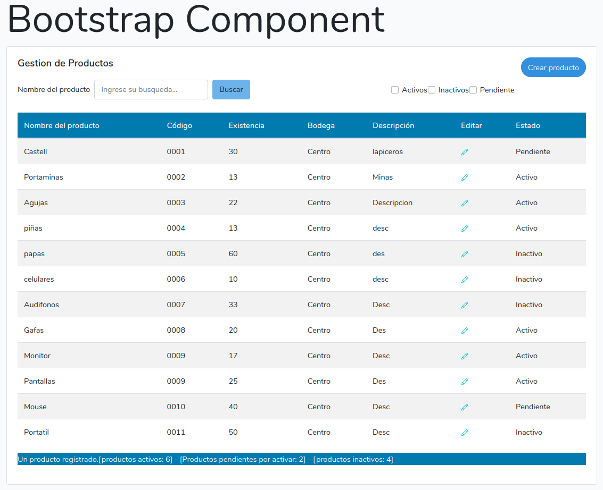

# CRUD Laravel, Vuejs ( ViewUI, Primevue, Vuetify )

Este CRUD se realiza con base de datos Mysql un ApiRest en backend con Laravel y diferentes Frameworks ( ViewUI, Primevue, Vuetify ) de Frontend con Vuejs separando el servicio de la lógica.

Se utilizan propiedades computadas para los filtros de los check y contadores de estados.

---

## Instalación

En la terminal ejecutar los siguientes comandos, no olvidar hacer una conexion a la base de datos en .env de laravel

```sh
Clona este proyecto. git clone https://github.com/jefmonva/Laravel-apirest-Vuejs.git

Ve a la carpeta del proyecto. cd primevue

Instala las dependencias. composer install

Instala las dependencias. npm install

Corre el ambiente local. php artisan serve

Corre el ambiente local. npm run watch
```

## Demo Imagenes del proyecto

---

## Diagrama base de datos



## ViewUI



## Primevue



## Vuetify



## Bootstrap



## API

Muestra la información dependiendo el tipo de respuesta HTTP. Ejemplo:

```sh
public function consultarProductos()
    {

        // Consultar a la base da datos
        $productos = DB::select("SELECT  p.* , e.nombre as estado, b.nombre as bodega
        			 FROM productos p
                                inner join estados e on p.id_estado = e.id_estado
                                inner join  bodegas b on p.id_bodega = b.id_bodega");


        // Validar la información de la consulta y mostrar respuesta
        if (!empty($productos)) {
            $json = array(
                "code" => 200,
                "status" => "success",
                "total_results" => count($productos),
                "productos" => $productos
            );
        } else {
            $json = array(
                "code" => 404,
                "status" => "error",
                "total_results" => 0,
                "message" => "Ningun registro encontrado"
            );
        }

        return response()->json($json);
    }
```

## License

The Laravel framework is open-source software licensed under the [MIT license](https://opensource.org/licenses/MIT).
